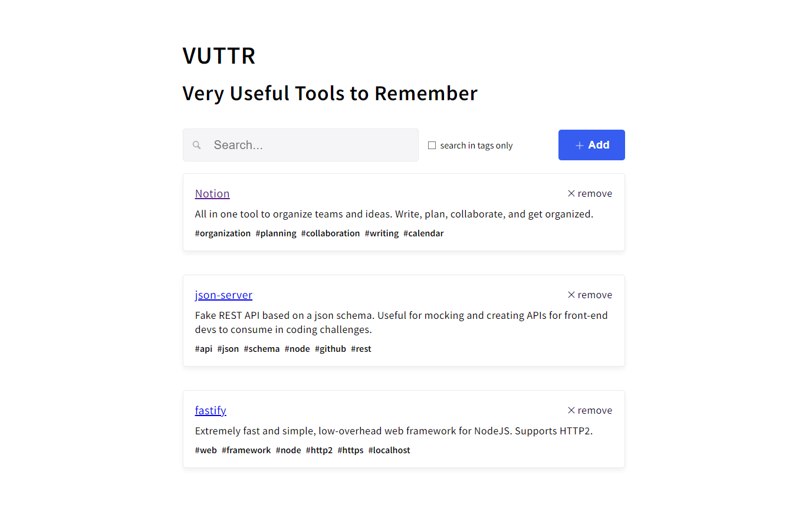

# Desafio Sozei

    
    
    
    
    

> Aplicação React para mostrar lista de ferramentas úteis, com interatividade para adição e remoção de ferramentas

## 🚀 How to use the project

### 🛹 Clone the front-end repo

`git clone https://github.com/andreseichi/desafio-sozei`

### 🛹 Clone the back-end repo

`https://github.com/sozei-ti/challenge-fake-api-master`

### 📒 Acess the back-end repo

`cd challenge-fake-api-master`

### 🧭 Install all dependencies with npm

`npm install`

### 🖥 Start the server

`npx json-server db.json`

### 📒 Acess the front-end repo

`cd desafio-sozei`

### 🧭 Install all dependencies with yarn

`yarn install`

### 🌎 Run it

`yarn start`
